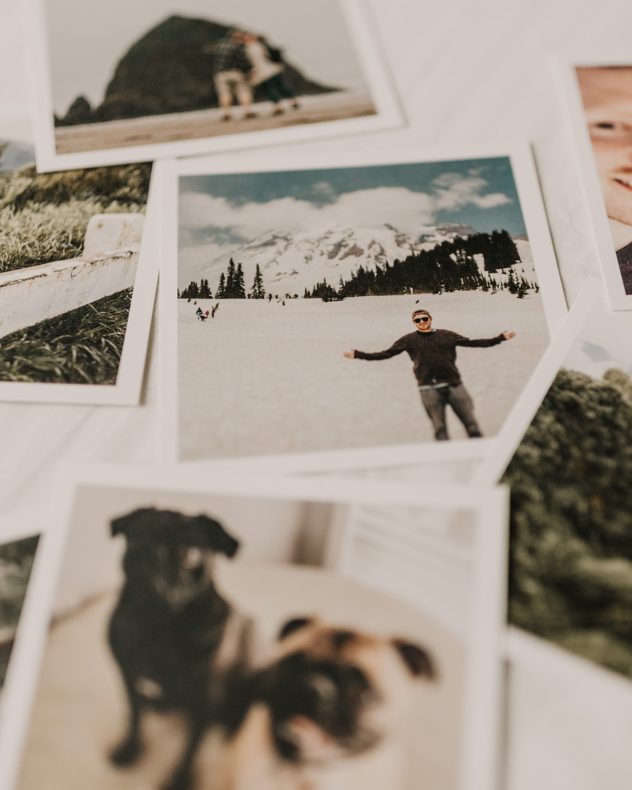

# Week: APIs

## Overview

After several weeks of taking a deep dive into web scraping, APIs and learning professional development tools we bring these skills together.

This week we'll begin to scrape, clean and analyze both natural text and images. We'll learn how to process the text and images we scrape from the web, request via REST APIs and obtain from pre-existing datasets.

## Applications

- [Monday]: 
    * [Datacamp: Image Processing in Python](https://campus.datacamp.com/courses/image-processing-in-python/advanced-operations-detecting-faces-and-features?ex=11)

- [Wednesday]:
    * [Datacamp: Introduction to NLP](https://app.datacamp.com/learn/courses/introduction-to-natural-language-processing-in-python)

- [Friday]: 
    * Coming...
