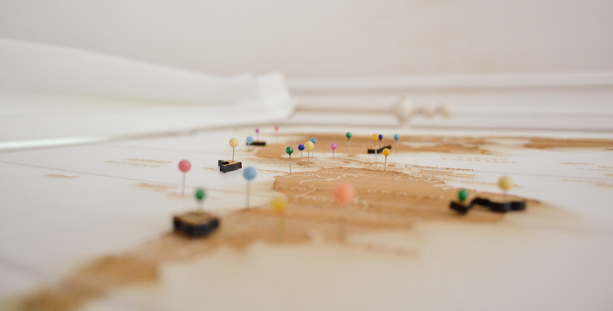

# Week: Mapping

**Computational Cultural Analytics**  
**Kenyon College**  
**Fall 2022**  

## Overview

Cultural analytics is the study of society and social phenomena by analyzing data and the way it flows. This course presumes some coding experience or the introductory course to Digital Humanities, Programming Humanity. We’ll build on our skills using API’s to create original datasets from social media sites like Twitter. Then we’ll develop natural language processing skills including sentiment analysis and topic clustering to explore text for insights. We’ll also learn how to graph and explore social networks. In class, we’ll do some hands-on projects like analyzing the social network of Game of Thrones and trying to classify who’s tweeting: Trump or Trudeau. In the final segment of the course, students develop their own project centered on their interests.

## Application

https://digitalhumanitiesnow.org/2018/06/editors-choice-torn-apart-separados/
https://xpmethod.columbia.edu/torn-apart/volume/2/

## Technical Background

GeoPy: https://melaniewalsh.github.io/Intro-Cultural-Analytics/07-Mapping/01-Mapping.html 
https://github.com/gboeing/osmnx-examples/tree/main/notebooks 
https://github.com/sshuair/awesome-gis
https://github.com/sacridini/Awesome-Geospatial 

## Coding Practice

Working with Geospatial Data in Python (4hrs)
(Datacamp) https://app.datacamp.com/learn/courses/working-with-geospatial-data-in-python 
(OSS Alternative) https://www.kaggle.com/learn/geospatial-analysis 

## Lab

Find at least 2 disparate shape/location datafiles and plot them onto the same map

