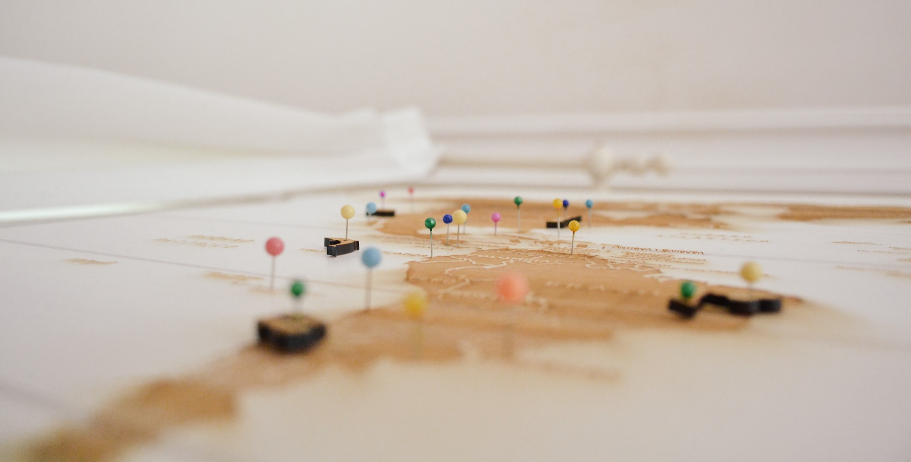
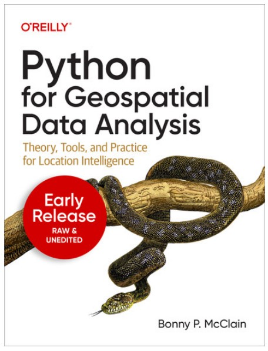

# Week: Mini-Project #1
---

## Overview

This week outside class we'll read the chapters of an upcoming book on Geospatial Data Analysis using Pyhon. Although some code is presented in later chapters, this is more an overview for non-coders interested in mapping. The loquacious style facilitates a quick read for high-level concepts. Look for universal patterns across various geospatial libraries, identify common workflows and bring any questions that arise during your readings to our class meetings. There is no coding outside class this week (no Datacamp).

In class this week we'll work on code in several existing Jupyter notebooks. We'll also do several coding exercises merging, manipulating and presenting geospatial data. By the end of the week you should have both a broad theoretic background in Geospatial analysis as well as a core ability to create, manipulate and present maps using Python and realted Geospatial libraries. Woo-hoo!

## Readings

- [Monday]:
    * Ch 1: [Introduction to Geospatial Analytics](https://drive.google.com/file/d/1efx44lDocuHcDim7gIpMGTyoKrwMcgNI/view?usp=sharing) from Python for Geospatial Data Analysis by Bonny P. McClain, O'Reilly Nov 2022
    * Ch 2: [Essential Facilities for Spatial Analytics](https://drive.google.com/file/d/19ajpcERnjCSwvt_-M2qE5kKwgDuZwSfj/view?usp=sharing) from Python for Geospatial Data Analysis by Bonny P. McClain, O'Reilly Nov 2022
    * Ch 8: [Data Cleaning](https://drive.google.com/file/d/1Qp6rF8zYGDzOP-qJm-rkqyjTtEVymp5r/view?usp=sharing) from Python for Geospatial Data Analysis by Bonny P. McClain, O'Reilly Nov 2022
- [Wednesday]:
    * Ch 3: [QGIS: Python for Spatial Analytics](https://drive.google.com/file/d/1xLq5mL2mDq2P74bTqkETQ6ZwRyyVxXkX/view?usp=sharing) from Python for Geospatial Data Analysis by Bonny P. McClain, O'Reilly Nov 2022
    * Ch 4: [Geospatial Analytics in the Cloud: Google Earth Engine and Other Tools](https://drive.google.com/file/d/1q4zJ1EhRw6yvNl3HwUhRlfzDS6PjDanf/view?usp=sharing) from Python for Geospatial Data Analysis by Bonny P. McClain, O'Reilly Nov 2022
    * Ch 5: [Open StreetMap: Accessing Geospatial Data with OSMnx](https://drive.google.com/file/d/1YwbrSaSDkFs7qkqmda8pv7_NhtjrBqVx/view?usp=sharing) from Python for Geospatial Data Analysis by Bonny P. McClain, O'Reilly Nov 2022
- [Friday]:
    * Ch 6: [ArcGIS Python API](https://drive.google.com/file/d/12uxstmQ5iJO6D9NhOtAo3wHn0Wvd6kqy/view?usp=sharing) from Python for Geospatial Data Analysis by Bonny P. McClain, O'Reilly Nov 2022
    * Ch 7: [GeoPandas and Spatial Statistics](https://drive.google.com/file/d/1zGp8aIny2A9jZh6mCVFkUuLU5o_FuYGJ/view?usp=sharing) from Python for Geospatial Data Analysis by Bonny P. McClain, O'Reilly Nov 2022

## Coding Practice in Class

Datacamp.com [Working with Geospatial Data in Python (4hrs)](https://app.datacamp.com/learn/courses/working-with-geospatial-data-in-python)

- [Monday]: Finding and Creating Geospatial Datasets
    * [Jupyter Notebook #1: Leaflet Key Features](https://colab.research.google.com/drive/10PwdvVQn_hr6u3ipx2MzF6-yE-BK2_CO?usp=sharing) 
    * [Jupyter Notebook #1: OSMnx](https://colab.research.google.com/drive/13AGkOw7jWMYkF82ZY27ZyR_HYWXMbzYM?usp=sharing)
- [Wednesday]: Basics of Geospatial Analysis
    * [Kaggle Course](https://www.kaggle.com/learn/geospatial-analysis)
- [Friday]: Presenting to the World
    * Create your own Geospatial visualization in a Jupyter Notebook from scratch

## Mapping Resources

[Taxonomy of Geospatial Analytics Resources for Mapping](https://github.com/jon-chun/resources-geospatial-analysis)

