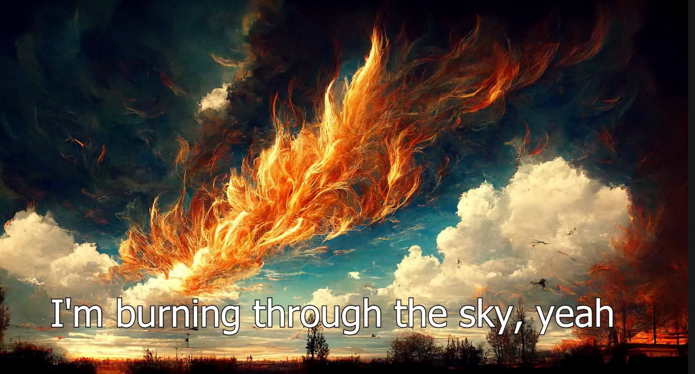

# Week: Mini-Project #2
---

# **UPDATE**

Click on image above to watch Midjourney AI-generated video using lyrics to "Don't Stop Me Now" by Queen

## Overview

This week we bring together all the many disparate and not-so-disparate skills honed over the past several weeks into Mini-Project #2. Over the past few months, text to image (and now video) generation has seen a dramatic leap forward with the introduction of new large AI models. This also aligns nicely with our own AI research, so we can lend an unusual degree of experience to this rapidly evolving field.

Creating text prompts (prompt engineering) to feed into these text2image models is one of the hottest areas of AI research recently, and we'll explore this further this week. This involves an all-hands-on-deck class project that decomposes nicely into smaller groups: text to image generation by recently released state-of-the-art large DNN models.

**GOAL:**

Research, search and scrape Twitter for images and prompts based upon the following 3 state-of-the-art text2image deep neural network (DNN) models:

1. [DALL-E 2](https://openai.com/dall-e-2/): [@openai](https://twitter.com/OpenAI)
2. Midjourney: [@midjourney](https://twitter.com/midjourney?ref_src=twsrc%5Egoogle%7Ctwcamp%5Eserp%7Ctwgr%5Eauthor)
3. [Stable Diffusion](https://stablediffusionweb.com/): [@stablediffusion](https://mobile.twitter.com/stablediffusion)

Our goal is to use what we've learned about scraping, APIs, NLP and image processing to find tweets with text generated images on Twitter. In particular, we want to collect the following:

1. the author/organization
2. text prompt with the associated
3. generated image
4. any other relevant information, comments or meta-information 

Everyone will be assigned into one of three groups representing each of the main three text2image DNN models listed above. Each group will independently research, scrape and analyze as much data as they can for their assigned DNN model. Then as a group, we will combine, compare, and critique our findings as a unified team.

## Readings

- [Monday]:
    * [The absolute beginners guide to MidJourney AI. Starting with AI Art](https://www.youtube.com/watch?v=PqCIUniQ_U8) (start at 20:00 and peruse for a 5-10 minutes to get a sense of how to interactively design prompt for image generation)
    * Research all 3 models including (start with the links at the top of this page under GOALS)
        * Websites (official and tutorials)
        * Reddit subthreads (r/subreddits)
        * Twitter (official and tutorials)
        * Twitter (artists and programmers)
    * [The Mind-Blowing DALL·E 2 Prompt Book](https://www.youtube.com/watch?v=1Qyo-rXUs38) Expand and read the description immediately below the YouTube video for links to various text2image social media users and groups.
    * [DALL-e Prompt Book](https://dallery.gallery/the-dalle-2-prompt-book/)
    * Review Twitter API (version 2) from previous weeks

- [Wednesday]:
    * [Design Guidelines for Prompt Engineering Text-to-Image Generative Models (7:33)](https://www.youtube.com/watch?v=7-XnIuH8r3U) Brief overview of [ACM paper](https://arxiv.org/pdf/2109.06977.pdf) on prompt engineering experiments 
    * (Gallery) [Lexica.art](https://lexica.art/) Scroll through, search and roll-over to view text prompt that generated each image
    * (Gallery) [PromptHero.com](https://prompthero.com/)
    * (Gallery) [NightCafe.Studio](https://creator.nightcafe.studio/explore)

- [Friday]:
    * [Lexica.art: API Instructions](https://lexica.art/docs)
    * [Freecodecamp.com: Web Scraping with Python, Tweepy and Snscrape](https://www.freecodecamp.org/news/python-web-scraping-tutorial/)
    * [Github Action to Scrape #depression Tweets Daily](https://github.com/ahmedshahriar/depression-tweets-scraper)
    * [How to Scrape Twitter with Snscrape](https://betterprogramming.pub/how-to-scrape-tweets-with-snscrape-90124ed006af) with     [Repo](https://github.com/MartinBeckUT/TwitterScraper/tree/master/snscrape)
    * [scrape_twitter_freecc.py](https://github.com/jon-chun/scrape-social-medias/blob/main/scrape_freecodecamp.py) Simple Twitter Scraper
    * [scrape_reddit_sentiment.py](https://github.com/jon-chun/scrape-social-medias/blob/main/scrape_reddit_sentiment.py) Simple Reddit Scraper

  

## Assignments:
---

**Teams:**

| Social Media | DALL-E 2 | Midjourney | Stable Diffusion |
| ------ | ----- | ----- | ----- |
| Twitter | Freddie | Jill | Jeremy |
|         | Ani     | Claire | Vikas |
| Reddit | Viet | Max | Devon |
|        | Teddy | Anav | Abbie |
|        | Tao | | |

**Identify Scrape Targets:**
* Official Social Media Accounts (e.g. @handles)
* Groups/Boards of Fans (e.g. subreddits)
* Search Terms (e.g. regular or #hashtags)
* Individual Artists
* Gallaries (e.g. Lexica.art)
* Other sources (e.g. Slack, Discord)

**Guidance:**
* Keep good notes as you go
* Give FULL DETAILS we need to scrape BOTH (a) Generated Images and (b) text prompts (+ possible explainations/given context)
  - Full URL paths/subdirectories
  - Unique usernames/handles/hashtags
  - Distinct and effective keywords/search terms
  - etc
* Try to group common patterns into a taxonomy as you to, make notes on what distinctive features you are using to base your classification on

## References

* [Git - The Simple Guide](https://rogerdudler.github.io/git-guide/)
* [Promptbase: A marketplace for text engineering](https://promptbase.com/)
* [Awesome Prompt Papers](https://github.com/thunlp/PromptPapers)
* [Python os.environ() vs python-dotenv](https://www.nylas.com/blog/making-use-of-environment-variables-in-python/)

## Twitter API Ver 2
* [Twitter Developer Platform Resources](https://github.com/twitterdev)
* [An Extenstive Guide to Collecting Tweets from Twitter API v2 for Academic Research Using Python 3 (Academic 10M/mo access level)](https://towardsdatascience.com/an-extensive-guide-to-collecting-tweets-from-twitter-api-v2-for-academic-research-using-python-3-518fcb71df2a)
* [Twitter API Ver 2: Reference](https://developer.twitter.com/en/docs/api-reference-index)
* [Twitter API Ver 2: Playground](https://oauth-playground.glitch.me/?id=listIdGet&params=%28%27id%21%271409935014725177344%27%29_)
* [Twitter API Ver 2: Query Builder](https://developer.twitter.com/apitools/query?query=)
* [Twitter API Ver 2 Annotations: Entities.Context](https://developer.twitter.com/en/docs/twitter-api/annotations/overview)
* [Twitter API Ver 2 Data Dictionary](https://developer.twitter.com/en/docs/twitter-api/data-dictionary/object-model/media)
* [Twitter API Ver 2: Examples](https://developer.twitter.com/en/docs/tutorials)
* [Twitter API Ver 2: Sample Code](https://github.com/twitterdev/Twitter-API-v2-sample-code)
* [Twitter API Ver 2: Notification via Integration with AWS/Twilio (Java)](https://developer.twitter.com/en/blog/industry-team-news/2020/get-customized-tweet-notifications-where-you-want-them)

## Discord
* [Awesome Discord Communities](https://github.com/mhxion/awesome-discord-communities)
* [Discord Official API](https://github.com/discord/discord-api-docs)
* [Discord API Python Wrapper](https://github.com/Rapptz/discord.py)
* [Discord RedBot](https://github.com/Cog-Creators/Red-DiscordBot)
* [PyDiscord Bot](https://docs.pycord.dev/en/master/index.html)
* [DiscordChatExporter (Win GUI/CLI)](https://github.com/Tyrrrz/DiscordChatExporter)

## Slack
* [Awesome Slack (3/22)](https://github.com/matiassingers/awesome-slack)
* [Slack Web Scraper](https://github.com/iulspop/slack-web-scraper)
* [Github + Slack Integration](https://github.com/integrations/slack)
* [Official Slack API](https://api.slack.com/)

## Other Scrapers & Bots
* [Awesome Bots (8/21)](https://github.com/DopplerHQ/awesome-bots)
* [Rasa Multichat Bot ML Automation](https://github.com/RasaHQ/rasa)
* [Mattermost Multichat Bridge](https://github.com/42wim/matterbridge)
* [disease-sh API and c19 scraper (JS)](https://github.com/disease-sh/API)

## Code Samples
* [Repl.it](https://replit.com/search?query=twitter)
* [Glitch.com](https://glitch.com/@twitter)
* [Hitomi Scripts](https://github.com/KurtBestor/Hitomi-Downloader/tree/master/src/extractor)
* [Twitter API ver 2 Sample Code](https://github.com/twitterdev/Twitter-API-v2-sample-code)
* [Elon Musk Tweet Auto Scraper](https://www.kaggle.com/code/zjjc123/elon-musk-twitter-daily-auto-scraper)
