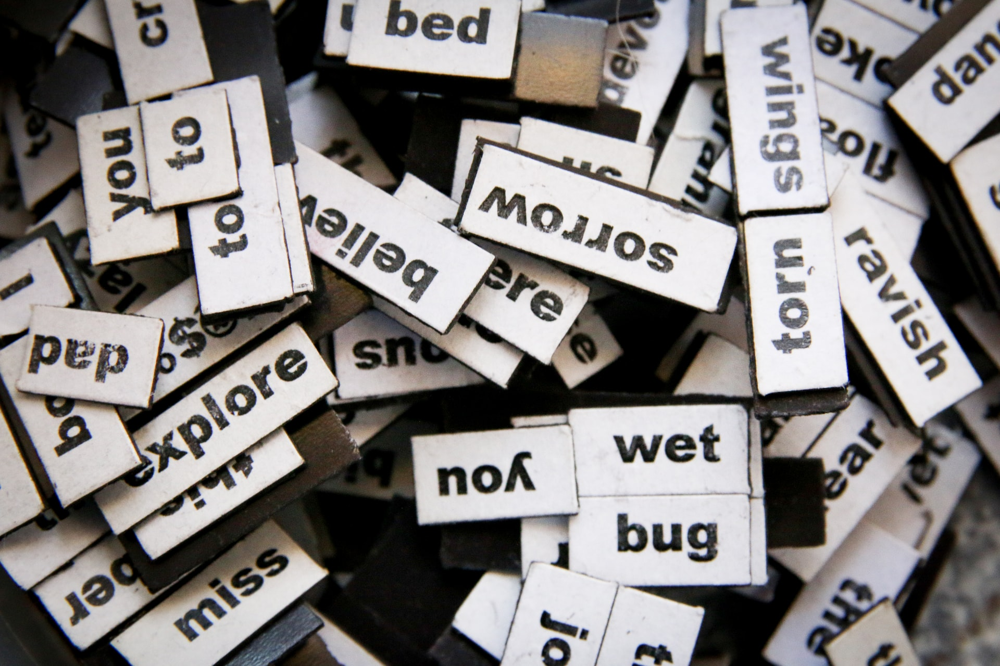

# Week: Advanced NLP

## Overview

Cultural analytics is the study of society and social phenomena by analyzing data and the way it flows. This course presumes some coding experience or the introductory course to Digital Humanities, Programming Humanity. We’ll build on our skills using API’s to create original datasets from social media sites like Twitter. Then we’ll develop natural language processing skills including sentiment analysis and topic clustering to explore text for insights. We’ll also learn how to graph and explore social networks. In class, we’ll do some hands-on projects like analyzing the social network of Game of Thrones and trying to classify who’s tweeting: Trump or Trudeau. In the final segment of the course, students develop their own project centered on their interests.

## Applications

- [Monday]:
    * [Web Scraping with Python, Everything You Need to Know 2022](https://www.scrapingbee.com/blog/web-scraping-101-with-python/)
    * [Getting Started with Twitter API ver 2 for Academic Research (DO ALL 8 Modules)](https://github.com/twitterdev/getting-started-with-the-twitter-api-v2-for-academic-research)
    * More coming...
- [Wednesday]: 
    * [Scraping Reddit with Python and Beautiful Soup 4](https://www.datacamp.com/tutorial/scraping-reddit-python-scrapy)
    * [How to Scrape Reddit and Automatically Label Data for NLP (13:07)](https://www.youtube.com/watch?v=8VZhog5C3bU&t=92s)
    * More coming...
- [Friday]:
    * [How to Scrape Everything from Instagram using Python](https://python.plainenglish.io/scrape-everythings-from-instagram-using-python-39b5a8baf2e5)
    * [Scraping every post on an Instagram profile with less than 10 lines of Pytho](https://dev.to/chrisgreening/scraping-every-post-on-an-instagram-profile-with-less-than-10-lines-of-python-1n8b)
    * [Instaloader](https://github.com/instaloader/instaloader)
    * [Simple Instagram Bot in Python (13:03)](https://www.youtube.com/watch?v=cW7kMeOUr20&t=613s)
    * More coming...

## Coding Practice

* DataCamp [Advanced NLP with SpaCy](https://app.datacamp.com/learn/courses/advanced-nlp-with-spacy)

## Lab Prep

* [GeoPy](https://melaniewalsh.github.io/Intro-Cultural-Analytics/07-Mapping/01-Mapping.html)

## Lab Assignment

Find at least 2 disparate shape/location datafiles and plot them both onto the same map using GeoPy.

