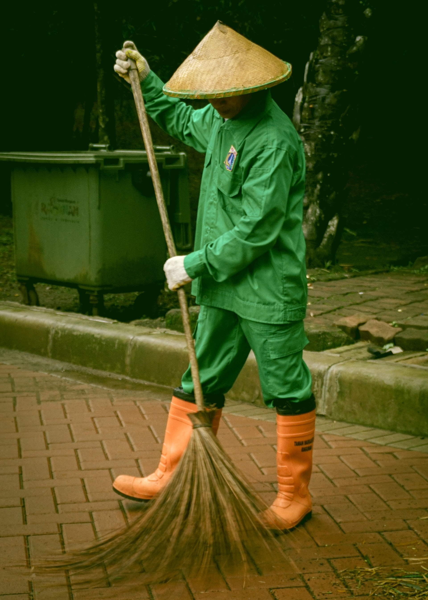

# Week: Scraping 

## Overview

Data is the Alpha and Omega of Data Science, Machine Learning and Deep Learning. The creativity, expressiveness and strength of your analysis will be bounded by the data you have. The quality of your dataset can be measured along many dimensions including the type/number of features, originality, number of datapoints, accuracy, coherence, etc.

While there are a rapidly growing number of public datasets, they often are best used for tutorials, training and establishing baseline metrics. It is extremely difficult to create new, innovative and meaningful data analysis based upon datasets provided by others. This week we study Web Scraping so you will be able to create your own unique datasets based upon the wide variety and vast quantity of information available on the Web. Along the way, you'll learn how the HTML metatag language (a type of XML markup) is used to structure web pages and separate content from visual presentation.

## Applications

- [Monday]: 
    * [Web Scraping Basics in Python (19:47)](https://www.youtube.com/watch?v=myAFVM7CxWk)
- [Wednesday]: 
    * [Beautiful Soup: Build a Web Scraper With Python](https://realpython.com/beautiful-soup-web-scraper-python/)
    * [goto API](./api.md)
- [Friday]: 
    * [goto API](./api.md)

## Coding Practice

* Datacamp.com [Intermediate Importing Data in Python (4hrs)](https://app.datacamp.com/learn/courses/web-scraping-with-python)

